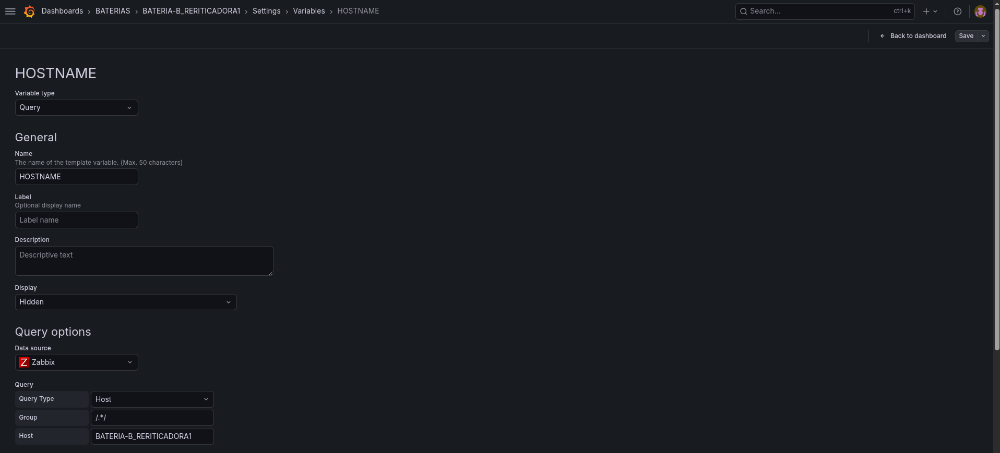
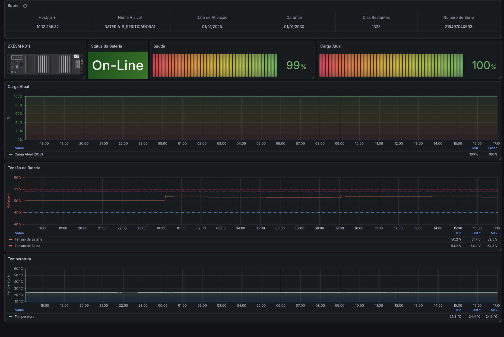

# Dashboard Grafana: Monitoramento de Bateria ZXESM R311

Este repositório contém a definição (JSON) de um dashboard no Grafana projetado para monitorar o estado operacional, saúde e ciclo de vida de baterias do modelo **ZTE ZXESM R311**.

## 📋 Visão Geral
O dashboard utiliza a fonte de dados do **Zabbix** e consultas **MySQL** para consolidar informações técnicas em tempo real. Ele permite uma visão completa da bateria, desde parâmetros elétricos até o controle administrativo de garantia.

## 🛠 Funcionalidades
O dashboard está organizado em painéis que cobrem:

* **Status Operacional:** Exibição clara do estado atual da bateria (Carregando, Descarregando, On-Line, Off-Line ou Desconectada).
* **Saúde e Carga:** Medidores (Gauge) que indicam o estado de carga (SOC) e a saúde da bateria (SOH) em percentual.
* **Dados Elétricos:** Gráficos temporais de Tensão de Entrada/Saída, Corrente e Temperatura.
* **Gestão de Ativos:** Painel informativo contendo:
    * Data de ativação, Garantia, Dias restantes e Número de série.

## 🔧 Configuração e Ajustes

### 1. Seleção de Host Dinâmica
Para que o dashboard funcione corretamente com diferentes hosts, é necessário configurar a variável `$HOSTNAME`:

* **Passo a passo:**
    1. Acesse as **Settings (Configurações)** do Dashboard no Grafana.
    2. Vá em **Variables** e edite a variável `HOSTNAME`.
    3. No campo **Query Options**, substitua o valor `VISIBLE_HOSTNAME` pelo `Visible Hostname` correto, conforme registrado no seu Zabbix.

### 2. Visão Geral do Dashboard
O painel abaixo apresenta os dados consolidados:

## ⚙️ Especificações Técnicas
* **Datasource:** Zabbix (Plugin: `alexanderzobnin-zabbix-datasource`).
* **Variáveis:** Utiliza `$HOSTNAME` para filtro dinâmico de hosts.
* **SQL (MySQL):** O painel "Sobre" realiza consultas diretas no banco de dados Zabbix (`zabbix` database) para cruzar dados de `history_str` e `history_uint` com a tabela `hosts`.

## 🚀 Como importar este Dashboard
1. No seu Grafana, vá em **Dashboards** > **New** > **Import**.
2. Cole o conteúdo do arquivo `.json` deste repositório na caixa de texto.
3. Clique em **Load** e selecione a sua fonte de dados do Zabbix no menu suspenso.

## ⚠️ Observações de Manutenção
* O cálculo da garantia é baseado na data de ativação (`enabledate`), considerando o período de 5 anos de garantia da ZTE, conforme registros de nota fiscal.
* O dashboard está configurado com `autoRefresh` de 5 minutos.
